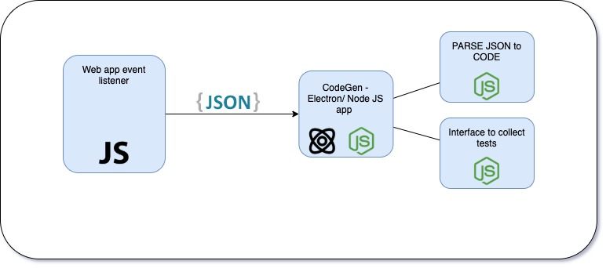

# Straightedge

Straightedge is(will be) a application that will generate code that can be run by mocha to perform end to end tests.

## Table of Contents
1) [Architecture](#Architecture)
2) [Introduction](#Introductions)
3) [Usage Guide](#Usage)
4) [License](#license)
### Architecture 

the architecture of this application is segmented to two main blocks:
1) the frontend(browser extension).
2) the backend(code generator).

As per the architecture the browser extension listens to the events by hooking on to the DOM. As it collects the events' information they are stored onto a JSON object. This JSON object is sent to the backend of the application by using a HTTP request.

In the Backend the JSON of the event history is received and it is processed. Based on the event type and action the entries are classified into different code blocks. these code blocks are then used to generate the Scripts needed to process the test suite.
### Introductions
From The Application architecture we can infer that the application is broken into two main parts.
1) the event sniffer, straightedge-fe, is a chrome extension and sample working of the extension is shown below.  You can read more about the code base for [straightedge-fe](./straightedge-fe/README.md). 

To read about the detailed explanation on the working and approach to building the extension read the Wiki.

2) the code generator straightedge.

### Installation
Installation guide for:
- [straightedge-fe](./straightedge-fe/README.md#installation) 
- [straightedge-fe-core](./straightedge-fe-core/README.md#installation) 

### Usage
Usage instructions of straightedge.
### License
GNU General Public License v3.0 or later

See [COPYING](./COPYING) file to see the full text.